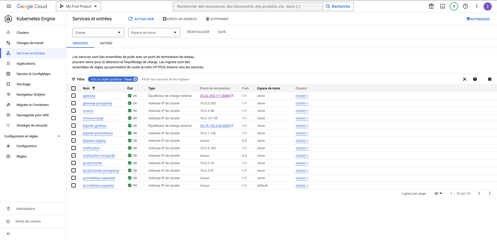
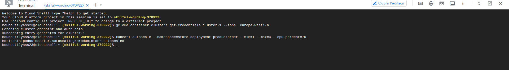
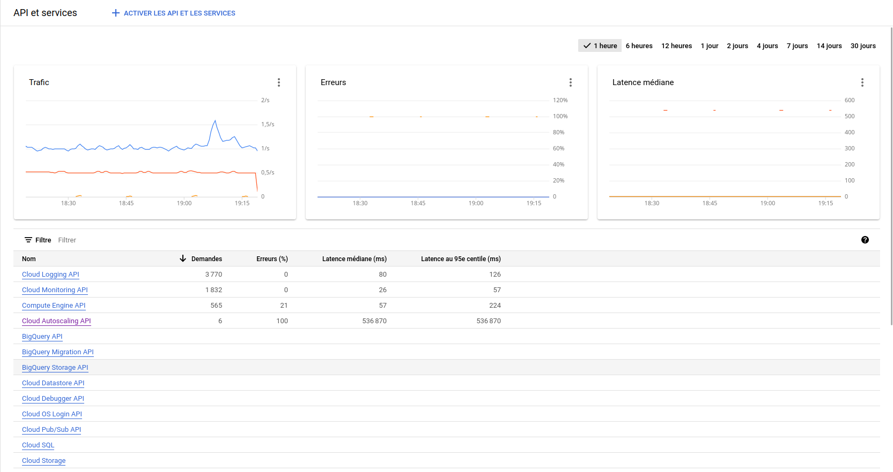
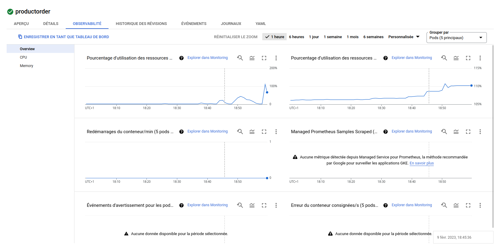
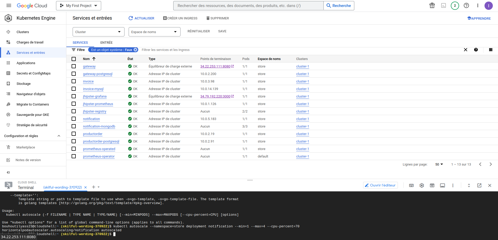
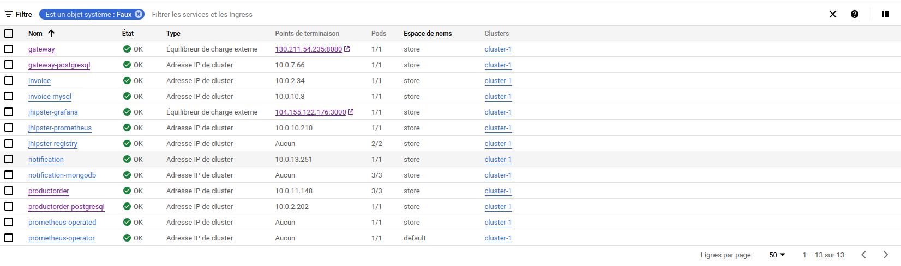
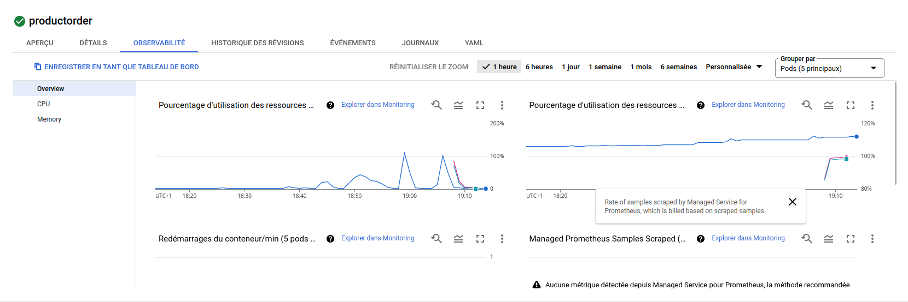

# **Microservices Architecture with JHipster**

In this project we will generate and deploy an application following a
microservices architecture with JHipster.

**Architecture :**

We will use a simple JHipster microservice architecture. A JHipster
Service Registry to provide service discovery and enables microservices
to communicate with each other using Haezlcast. A JHipster API Gateway
to act as a reverse proxy for all the microservices, and provide a
unified and secure API for the clients. And three microservices:
\"productorder\", \"invoice\", and \"notification\". Each microservice
is connected to its own database: \"productorder\" uses a MySQL
database, \"invoice\" uses a PostgreSQL database, and \"notification\"
uses a MongoDB database. This is a common design pattern in microservice
architectures where each microservice is responsible for a single
functionality and can use its own database that is optimized for its
specific needs.

I.  **deployment :**

> here we used these steps to deploy a microservice application with
> kubernetes :

-   Package the Microservices: Each microservice should be packaged into
    > a Docker image. Here, we used Gradle to build the docker images.

-   Then, we created the docker-compose files using jhipster

-   Create a Kubernetes Cluster: We need to create a Kubernetes cluster
    > in the GCE region

-   We pushed the Docker Images to a Container Registry: The Docker
    > images for each microservice should be pushed to a container
    > registry, we used docker hub

-   We launched the containers

-   Then, we run the script kubectl-apply.sh generated by JHipster to
    > run the kubectl commands

In the screenshot below we can clearly see the list of services deployed
in a Kubernetes cluster "cluster-1" such as productorder , invoice and
gateway-postgresql.

{width="6.267716535433071in"
height="3.0416666666666665in"}

II. **horizontal scalability :**

Horizontal scalability is the ability to increase the capacity of a
system by adding more resources, such as additional machines, instead of
upgrading the individual components.

The screenshot below shows the command we used to enable horizontal
scalability on the product order microservice as an example.

{width="6.356847112860892in"
height="1.144915791776028in"}

This command is used to automatically scale the number of replicas of a
deployment based on CPU utilization. Actually it configures autoscaling
for the \"productorder\" deployment, with a minimum of 1 replicas and a
maximum of 4 replicas, based on the average CPU utilization across all
replicas. When the average CPU utilization of the deployment exceeds
70%, the number of replicas will be automatically increased up to a
maximum of 4. Similarly, if the average CPU utilization falls below 70%,
the number of replicas will be automatically decreased.

The command uses the kubectl autoscale command and the following
parameters:

\--namespace=store: Specifies the namespace in which the deployment
resides. In this case, the namespace is \"store\".

deployment productorder: Specifies the deployment that you want to
autoscale. In this case, it\'s the deployment named \"productorder\".

\--min=1: Specifies the minimum number of replicas that the deployment
should have. In this case, the minimum is set to 1.

\--max=4: Specifies the maximum number of replicas that the deployment
should have. In this case, the maximum is set to 4.

\--cpu-percent=70: Specifies the target CPU utilization for the
deployment. The autoscaler will increase the number of replicas if the
average CPU utilization across all replicas goes above this threshold,
and decrease the number of replicas if it goes below this threshold. In
this case, the target CPU utilization is set to 70%.

III. **gcp dashboards :**

The figure below is a google cloud dashboard. It displays various
metrics related to traffic, errors, and latency.

-   Traffic metric, provides information about the volume of traffic
    > being processed by the system, such as requests per second, data
    > transferred, and bandwidth utilization.

-   Error metric, provides information about the number and type of
    > errors that occur in a system, such as failed requests,
    > exceptions, and timeouts.

```{=html}
<!-- -->
```
-   Latency metric, provides information about the time it takes for a
    > system to respond to a request here we plot the median to get an
    > indication of the overall performance of a system.

{width="6.267716535433071in"
height="3.3194444444444446in"}

IV. **gatling report and monitoring :**

The gatling script we wrote is present in the root of the github
project. The token that allows us to access the secured api of our app
is being written statically (whenever it becomes obsolete, we regenerate
it manually by authenticating using the /api/authenticate endpoint)

Before enabling horizontal scalability on the productorder microservice,
we load tested our app by stressing the
/services/productorder/api/products endpoint with GET http requests. We
used two laptops and executed a gatling script simultaneously to
increase the stress on the app. That enabled us to send 20 thousand
requests in 60 seconds.

The picture down below shows that cpu consumption of the pod running the
productorder microservice spiked above 100% when we stressed our app.

{width="6.267716535433071in"
height="3.0694444444444446in"}

We can see that the productorder microservice is being run in only one
pod, even when it's being stressed by multiple requests. This will be
fixed by enabling horizontal scalability on the productorder
microservice.

{width="5.541666666666667in"
height="2.1979166666666665in"}

After enabling horizontal scalability on the productorder microservice,
we stressed our app using the same process as before. And since we know
that by doing so, our cpu consumption will surpass the threshold (set to
70%), we knew that our productorder microservice will autoscale. And
that was the case, we observed that the productorder microservice scaled
automatically and was being run in 3 pods (instead of 1 initially)

3 pods running the productorder microservice.

{width="6.267716535433071in"
height="1.8611111111111112in"}

In the following figure , we see the 3 pods running after reaching the
CPU consumption threshold :

{width="6.267716535433071in"
height="2.0972222222222223in"}
